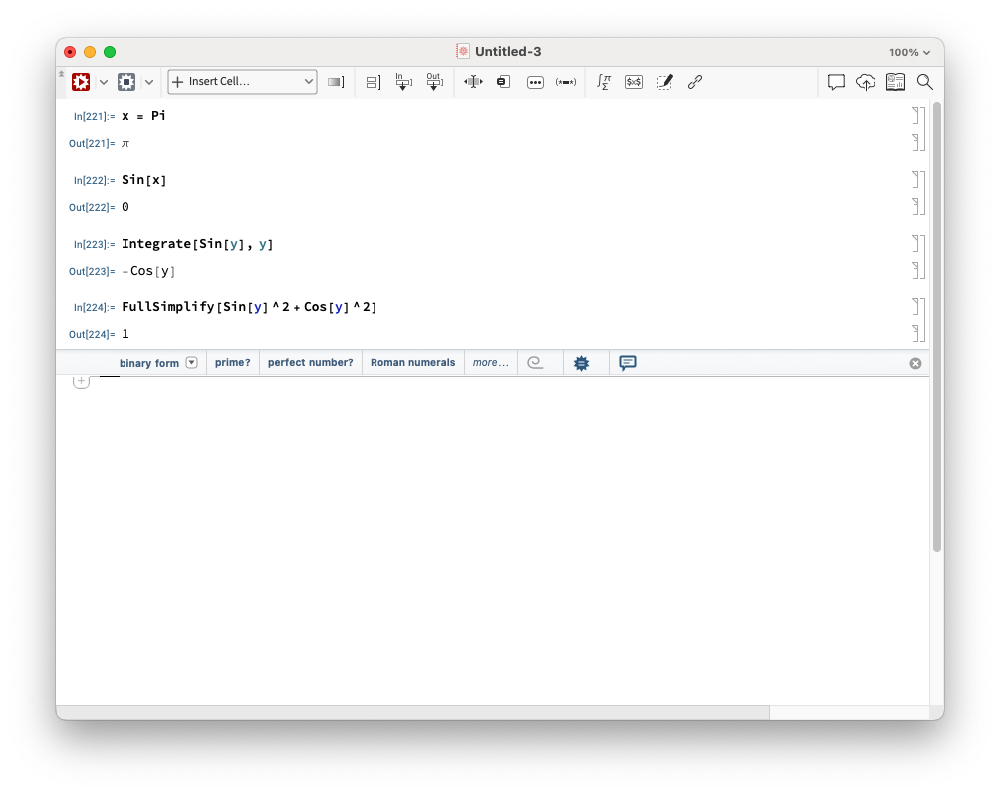

# Intro to Mathematica

Mathematica is a Swiss army knife for mathsy computations. It has lots of built-in functionality and is often a great place to start doing any calculation, but IMO it is not going to be fast or convenient for heavy computations or for writing complicated programs. It is also closed source and requires an expensive license to run.

## Installation

The University of Nottingham has Mathematica server licenses which allow you to run it at work, or through the VPN. For more information see the [UoN Workspace documentation on Mathematica](https://workspace.nottingham.ac.uk/display/Software/Mathematica) and the [UoN VPN documentation](https://www.nottingham.ac.uk/dts/communications/remote-working/vpn.aspx).

## Usage

Using Mathematica is very much like writing Jupyter notebooks, if you are familiar with that. Basically you write one cell of code and evaluate it, then you write another cell and repeat.

As a programming language, it tends to steer you towards writing in a functional programming style. It doesn't have classes or anything like that.

There are two main file types in Mathematica:
- `.nb` files, which are your notebooks. They store information about the last time they were run, so if you rerun them the file changes (so are difficult to follow with git).
- `.m`. (old style) or `.wl` (new style), which store pure code and so allow you to write packages and things. They can be run similarly to the `.nb` files but because they only store the code, not the output of runs, they can be followed reasonably with git.

Mathematica's built-in things all start with capital letters and use Pascal case (also known as dromedary case). Function calls use square brackets (instead of rounded ones like C or Python). Here are some random examples,
```Mathematica
x = Pi
Sin[x]
Integrate[Sin[y], y]
FullSimplify[Sin[y]^2 + Cos[y]^2]
```
Writing and running these as separate cells in Mathematica shows the following,



Note that Mathematica starts counting at 1, not at 0 like Python. Note also that Mathematica stores the values of everything you have evaluted in memory, and this can cause some difficult-to-debug errors if you are not careful. To counter this, the following commands are very useful, 
```Mathematica
ClearAll[x]
Quit[]
```
The former clears what is associated with the variable `x`, the latter "quits the kernel" and so clears everything.

## Documentation

There are [docs online](https://reference.wolfram.com/language/), which can be accessed directly within Mathematica by hovering over the unknown element, or by clicking on Help. There is also a [Mathematica Stack Exchange](https://mathematica.stackexchange.com/), and on arXiv a helpful resource called [Using Mathematica for Quantum Mechanics: A Student's Manual](https://arxiv.org/abs/1403.7050).

## Examples

See the `.nb` files in this directory.